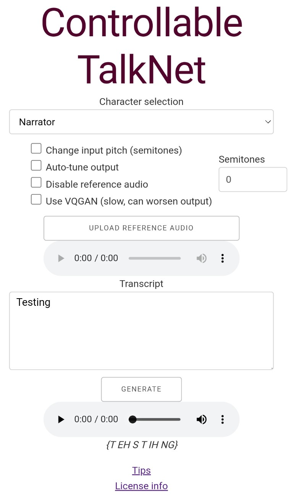

# CTN-webapp

This is a fork of the Controllable TalkNet project that can be deployed as an online webapp for the public to use.



## How to run
### Dependencies
* Docker
* Linux (only tested on Ubuntu 20.04)
* Bash
* at least 4GB of RAM (but more is better)
* Optional: `npm i -g uglify-js uglifycss`

#### Default that should work on most machines:
```bash
./rebuild.sh # This is equivalent to:
# DEVICE=cpu SERVER_TYPE=debug PRELOAD_MODELS=false MODEL_CACHE_SIZE=4 ./rebuild.sh
```
The webapp will be accessible at http://localhost:8050.

The models from the original Controllable TalkNet project are available by default. Delete the model list at `ControllableTalkNet/model_lists/sortanon_models.json` if you do not need them.

#### GPU-enabled runtime
```bash
DEVICE=gpu ./rebuild.sh --gpus all
```
### All env options
* `PORT` - integer (default = 8050)
* `DEVICE` - `cpu` or `gpu` (default = `cpu`)
  
  Use `--cpus` or `--gpus` to specify the number of CPU cores / GPUs to allocate to the container.
* `SERVER_TYPE` - `debug` or `uwsgi`
  * `debug`: use the debug werkzeug `Flask.app.run` server.
  * `uwsgi`: run the app with `uwsgi` on `socket = 8050`. To be used in conjunction with nginx/apache.
* `MODEL_CACHE_SIZE` - integer (default = 4)
  
  The number of models to keep cached in memory during runtime. Increasing this value will increase the amount of RAM this app requires to not crash.
* `PRELOAD_MODELS` - `true` or `false`
  
  Whether to download and read all models into memory upon startup. If the number of models available is larger than `MODEL_CACHE_SIZE`, only `MODEL_CACHE_SIZE` models will remain in memory after startup.

Additional options can be passed to `docker run` by simply appending them to the `./rebuild.sh` command. For example, to limit the memory use of this container to 16GB:
```bash
./rebuild.sh -m 16g
```

## Notes
* The `Custom model` option has been removed from the app. They present an obvious security risk and I am not interested in attempting to safety validate arbitrary models. Please add all models desired to `model_lists_extra/` before building the app.
* The frontend design is slightly different from the original CTN project. It's a static HTML/JS/CSS copy of the original Jupyter Dash app.
* The contents of individual POST requests are not logged. However, audio files uploaded to the server are saved until the container is destroyed.
* The app usually breaks if `uwsgi` is configured to run with multiprocessing. I was unable to find the source of this bug.
* There is a memory leak somewhere in the app, unrelated to model caching. I was unable to find the source of this bug.

